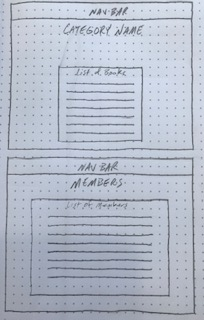

# Library App
My Project 4 is a library app. 

## Links

1. Trello - https://trello.com/b/18ISbLzq/library-app
1. Heroku - https://library-book-app.herokuapp.com/
1. Open Library (API) - https://openlibrary.org/dev/docs/restful_api

## Coding languages and libraries

* HTML
* CSS
* JavaScript
* Python
* Django
* AJAX
* React
* React Bootstrap

## Features

* Add, view, edit, and delete a category name
* View list of categories
* Add, view, edit, and delete a book
* View list of books
* Add, view, edit, and delete a member
* View a list of members
* Search book information using ISBN via an external API

## ERD:

## Wireframe:

## Future Release Features:
* Search by title of book
* Search by author
* Add a volunteers model
* Make editing books only accessible to admin

